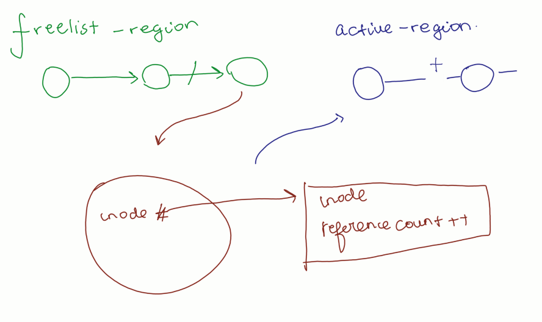
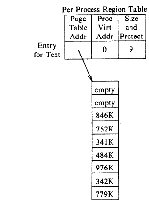

### Process Table:
* 7 Things
* Contains
    |Purpose| Name of the thing|
    |-|-|
    What process doing| state field
    context switch| Process Table Entry and U-area
    Relations and IPC | PID
    To put to Sleep| Event Descriptors
    Priviledges|UID
    Interrupts|Signal 
    Scheduling | Scheduling Parameters, Execution Timers

### User Area:
* 11 Things
* Contains
    |Purpose | Name|
    -|-
    Process management and Context switch| [Process Table Pointer](#processTable)
    Priviledges General| Uids
    Priviledges Files| Permission Mode
    File Handling| file Descriptor
    Signal Handling| Signal array
    Terminal-process| Terminal Control field
    logging errors | Error fields
    Input/Output | IO parameters
    return values| return field
    environment|current directory and root
    restrict process size| Limit fields

### Layout of Memory:
* `To avoid one process accessing other Process Text, data, stack - Virtual Address space used`
* Entire Memory is divided into **pages** of same size.
* Pointers to different pages stored in region table, in the logical order of the pages.

### Layout of Kernel:
 * `To avoid using kernel U-area in user mode, systems use Register Triples`
* These Triples contain:
    * Page table pointer
    * Virtual Address starting
    * Number of pages in page table
* Seperate  different register triple for User mode and Kernel mode regions.
* These Triples come under Kernel data-structures.
* So eventhough seperate register triple for user mode, they can only be accessed through **Kernel Mode**

### Context of Process:
* Register Context:
    * PC, PS, Stack
* System level context :
    * Static
        * Process table entry
        * Uarea
        * Pregion table, region, page table
    * Dynamic:
        * Kernel Stack and context layer
* User level:
    * Text, data, Stack

## Interrupt Handling:
 1) Save Context:
    *  current [context](#contextProcess), pushed in context layer of kernel stack.
 2) Interrupt Service:
    * Interrupt Identified.
    * Unit number for it found.
    * Interrupt vector entry accessed.
    * Runs the interrupt handler function above the context layer.
    * Completes and returns
2) Load Context and continue

### Interrupt vector table:

### algorithm int_hand() : none
    
    save the current context.
    identify the interrupt
    get unit number of interrupt vector
    find the interrupt vector from table
    call the interrupt handler
    load the previous context

## 1) System Calls:
* System calls with c contain assembly language procedure calls known as **traps**.
* Table for system call number and trap 

### sys_call(sys_call_num) : result

    Find the entry in system call table for the sys_call_num
    find the number of parameters
    copy the parameters from user address space to u-area
    save context
    begin execution of system call
    if error:
        set register bit 0 to error
        carry bit in PS = 1
    else:
        set register bit 0,1 to result
        
## 2) Context Switch
* Performed if:
    * exit
    * sleep
    * return
    * interrupt

### algorithm:
    Check if switch allowed, then
        Save context
        Execute The next process
        load context

### Context switch can be done for abortive returns:
* Error handling in c.

|call|function|
|-|-|
setjmp|Save context
longjmp|load context

## 4) Manipulating Address Space:
* Region Table contains:
    * type - Text, Data, Stack
    * size
    * location
    * status 
        * lock, demand, valid, loading
    * reference count

> ASSUMPTION:  There is a linked list of free regions and active regions
### 1) Allocate/Free Regions
#### Allocreg(inode pointer, region type): region
    get region from free-list
    set inode number in region
    set region type
    if inode not null:
        increment inode reference count
    put region on active list
    return region

#### free_reg(region):None
> Note: region reference count decremented by Detach

    if reference count > 0:
        release region lock
        if inode not null:
            release inode lock
        return
    if inode not null:
        iput(inode)
    free pages tables 
    free physical memory
    clear region fields
    put onto free list
    unlock region
### 2) Attach/Detach Regions to process
* All about creating pregion table.
* Now only reference count of regions change

#### attach_reg(region,process,virtual address,type): Pregion

    allocate a pregion table to process
    
    // Set necessary fields of pregion
    in pregion table, set:
        The region pointer
        Virtual Address
        Type
    
    // increment necessary field of region
    increment reference count
    increment process size

    set register triple for process

    return pregion

### detachreg(pregion's entry)
    region reference decrement
    process size decrement
    if region count 0 and region not sticky:
        free(region)
    else
        free inode lock
        free lock
### 3) Grow
* increase the size of pregion table by adding more pages
### growreg(pregion entry, grow size) : none
    if increasing:
        if grown region within bounds:
            create page table
        if no demand paging:
            allocate physical memory
            init page table
        return
    else:
        remove necessary page table
        deallocate physical memory
    set size

### 4) Load Region:
* possible with read system call

### loadreg (pregion entry, virtual address, inode pointer, byte offset, byte count):
        grow reg by amount of data
        mark region: LOADING
        lock region
        set up u-area parameters:
            virtual address
            offset
            count
        read file
        unlock region
        mark region : Loaded
        wake all process for region
### Duplicate region:
* method changes based on type of region
    
### dupreg(pregion_entry): new region
    if region shared:
        return same region
    allocreg()
    create auxilary table
    create physical memory
    copy
    return region
## 5) Sleeping and waking up Proccesses:
### Sleep
* Three flows:
    * If process not interruptable
    * If process interruptable and currently has signals
    * interruptable and no signals 

### Sleep(sleep address, priority):

    raise execution level
    set process status to sleeping
    put process on sleep buffer
    if(process not interruptible){
        do context switch
        set orginal execution level
        return 0
    }
    if process interruptible:
        do context switch
        if theres any pending signal:
            set original exection level
            return 0
    remove from sleep buffer
    set original execution level
    if process priority to catch:
        return 1
    longjump

### WakeUP
#### Wakeup(sleep_address):
    execution level high
    find hash queue for sleep address
    for each process in sleep address:
        clear sleep address
        remove from sleep buffer
        status = ready
        mark ready to run
        put to scheduler list
        if process not in main memory:
            wake up swapper process
        else if process has more priority:
            mark with scheduler flag
    execution level low

## Process Control:
#### 1) fork():

    check not to many process running and resources available

    create a new Process Table entry with Unique PID
    set THe status of processs creating
    copy the process table of parent to child
    increment the inode references of directory and root
    increment file open
    copy the parent uarea(text,data,stack) to current child context
    continue execution here
    if parent executing:
        set child ready to run
        return childPID
    if child running:
        set timers
        return 0
#### 2) Signal
### Issig(): true if not ignored, else false
    while the signal field non-zero:
        get signal number sent to process
        if death of child:
            if ignored:
                clear the zombie child from memory
            if catching signal:
                return true
        else if not ignored:
            return true
        set signal number to zero
    return false
### psig():

    get signal number from the process table entry
    clear the signal number in process table entry
    if system call to ignore signal:
        return 
    if process has to catch signal:
        get virtual address of signal catcher
        remove the address from the u-area from calling again
        change user-level context:
            user stack frame to mimic catcher
        change system level context:
            set PC to the address of catcher
        return
    if core dump signal:
        create a file called core in directory
        write process u-area to file
    exit() immediately
### 3) process termination
### exit():
    if process group leader:
        hangup call to group
        set group for all process in the group to 0
    close all the files
    decrement the directory inode
    decrement the root inode
    dealloc all the regions
    write accounting data
    if any child:
        set ppid to 1 - init
    if any zombie child:
        sent death of child signal to init
    sent death of child to parent of current
    return
### 4) wait process termination
    if no child process:
        return error
    while:
        if zombie child present:
            select a zombie child
            add the child usage to parent
            return 0
        if no children:
            return error
        sleep
### 5) exec
    get inode of the executable
    check the permissions of exe file
    check header and find load module
    for all regions in current process:
        dealloc all of them
    for all regions in load module:
        allocreg:        
        attachreg:
        Loadreg:
    set u area parameters of exe
    iput the inode of executable
